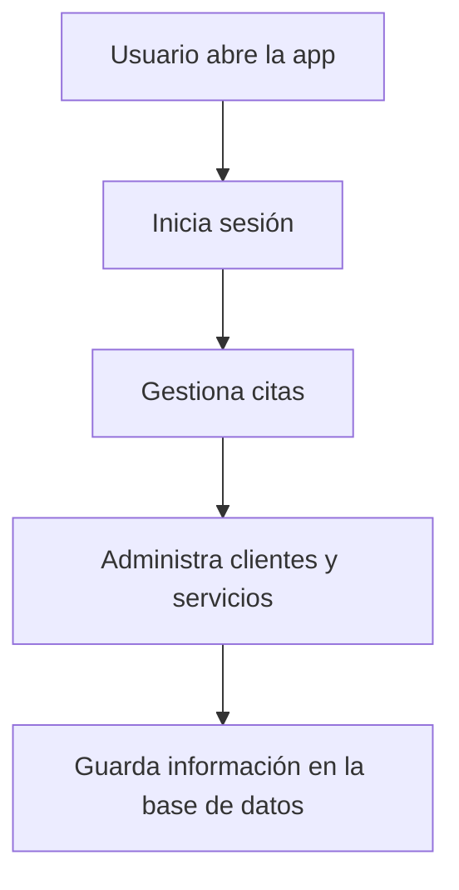

# ✂️ Peluquería Al Corteccino

> Sistema de escritorio para gestionar citas, clientes, servicios y productos de una peluquería con una interfaz moderna y funcional.

## 🌟 Descripción general

Peluquería Al Corteccino es una aplicación de escritorio desarrollada en Java con una arquitectura orientada a objetos y conexión a base de datos. Está diseñada para facilitar la organización diaria de una peluquería, optimizando la gestión de reservas, clientes y servicios.

La aplicación ofrece una experiencia visual simple, clara y rápida, pensada para que el personal pueda trabajar de forma ordenada sin perder tiempo.

---

## ✨ Funcionalidades principales

- Gestión de clientes
- Registro y administración de citas
- Control de servicios y productos
- Gestión de personal y usuarios
- Interfaz visual para operaciones rápidas
- Integración con base de datos relacional

---

## 🧰 Tecnologías utilizadas

- Java
- Swing / NetBeans GUI Builder
- Apache Ant
- MySQL
- SQL scripts para la base de datos

---

## 🏗️ Estructura del proyecto

```text
src/
├── bd/                  # Scripts SQL de la base de datos
├── controlador/         # Lógica de conexión y consultas
├── modelo/              # Clases de negocio (Cliente, Cita, Producto, etc.)
├── vista/               # Interfaces gráficas de la aplicación
└── styles/              # Estilos y recursos visuales
```

---

## 🔄 Flujo de uso



---

## 🚀 Instalación y ejecución

1. Clona o descarga este repositorio.
2. Abre el proyecto en NetBeans.
3. Asegúrate de tener configurada la base de datos MySQL.
4. Importa el archivo SQL ubicado en:
   - `src/bd/bd_alcorteccino.sql`
5. Compila y ejecuta la aplicación desde el proyecto.

### Ejemplo de configuración

```sql
CREATE DATABASE bd_alcorteccino;
```

> Ajusta los datos de conexión en la clase de configuración según tu entorno local.

---

## 🗄️ Base de datos

La aplicación utiliza una base de datos relacional para almacenar:

- Usuarios
- Clientes
- Citas
- Servicios
- Productos
- Personal

Los scripts SQL se encuentran en la carpeta `src/bd/`.

---

## 🎯 Objetivo del proyecto

Este proyecto busca ofrecer una solución práctica y funcional para la gestión de una peluquería, combinando la lógica de negocio con una interfaz accesible para el usuario final.

---

## 🛠️ Próximas mejoras

- Mejoras en la interfaz visual
- Más reportes y estadísticas
- Integración de alertas y recordatorios
- Mejor manejo de horarios y disponibilidad
- Versión web o multiplataforma

---

## 👤 Autor

Proyecto desarrollado como parte de un portafolio personal y desarrollo de software orientado a aplicaciones de escritorio.

